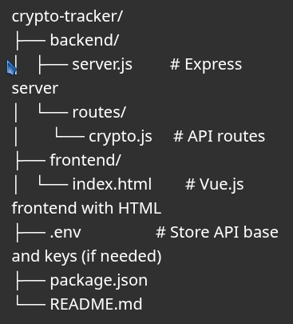

# Cryptocurrency Tracker

A real-time cryptocurrency tracker app that displays prices and market trends using the CoinGecko API.

---

# Output 


## Tech Stack
- Frontend: Vue.js + HTML
- Backend: Node.js + Express.js
- API Source: CoinGecko

---



## How to Run

1. Install dependencies:
   ```bash
   npm install
   ```

2. Start the server:
   ```bash
   npm start
   ```

3. Open `frontend/index.html` in your browser.
